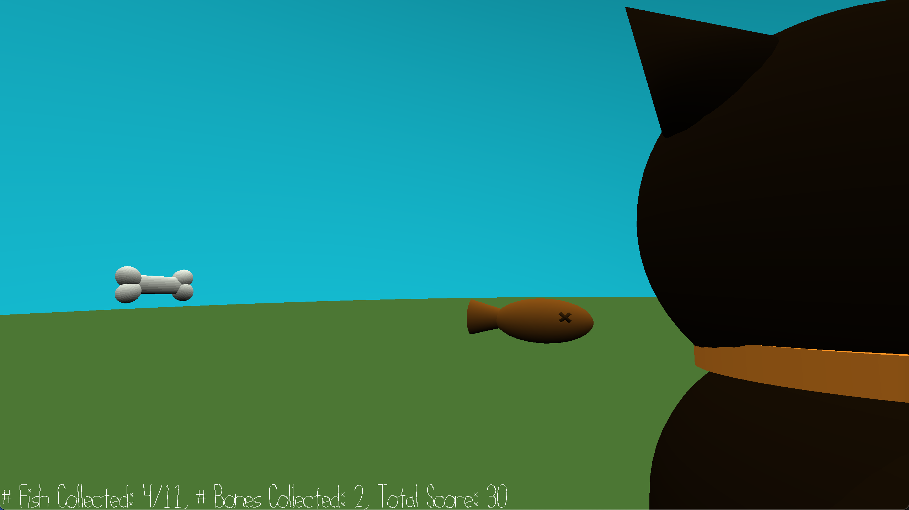

# Fishy Fiend!

Author: Emma Liu

Design: After staying couped up all day without attention from his working parents, Park, my roommate's cat, wants to go on an adventure! Luckily he found a field full of yummy fishy snacks, and he's ready to eat!

Screen Shot:

How To Play:

Navigate through the field to collect as many fish as you can, and avoid the bones - Park's no dog, bones aren't yummy to him!

Controls: 
- `W/A/S/D` to move Park around the scene
- Mouse motion (activated by mouse click) pans camera POV around the scene (but Park won't necessarily face the direction it points in! He's got a mind of his own.) Press `ESCAPE` to quit camera panning view.

Sources: All Blender items were built by myself.

This game was built with [NEST](NEST.md).

